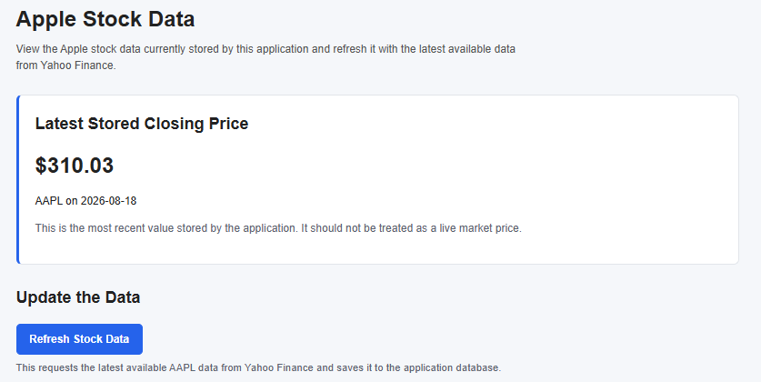
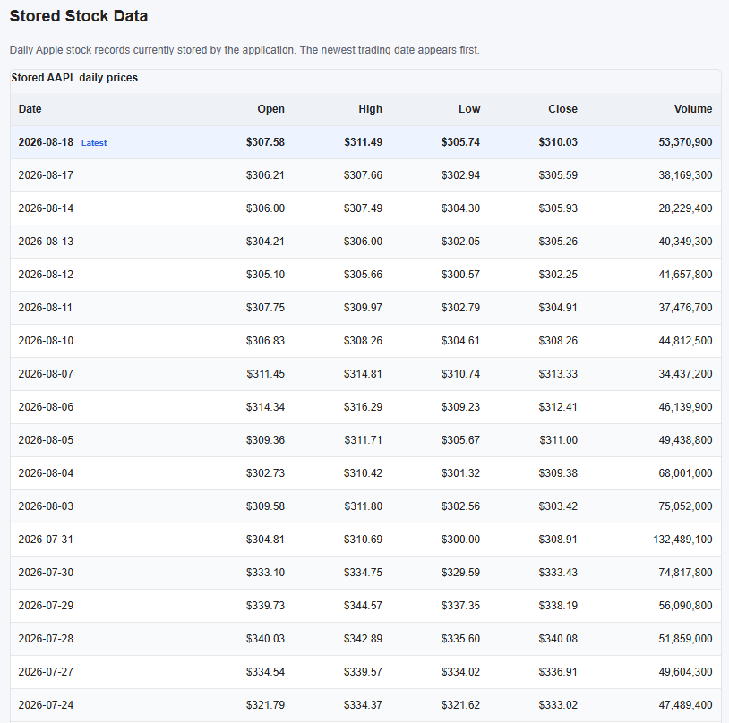

# Stock Data Project

## Project Overview

The aim was to build a small end-to-end application that can fetch Apple stock data, store it in a database, and make that data available through a simple interface.

I tried to keep the project fairly small and understandable rather than adding technology that was not really needed for the task.

The application:

- Fetches Apple stock data from Yahoo Finance using `yfinance`.
- Validates the data before storing it.
- Stores daily stock prices in SQLite.
- Prevents duplicate ticker/date records.
- Makes the stored data available through FastAPI.
- Provides a small HTML/Jinja2 frontend.
- Runs locally or through Docker.
- Uses a Docker volume so the database persists between containers.
- Includes automated tests using pytest.
- Uses GitHub Actions for formatting, testing and Docker build checks.

The main stock used and tested throughout the project is:

```text
AAPL
```

---

## Application Preview

The frontend gives a simple view of the latest stored Apple stock data and allows ingestion to be triggered without needing to call the API directly.



The stored daily records are displayed in a simple table, with the newest trading date shown first.



On a fresh installation the database starts empty, so the frontend first shows a clear empty state with a **Load Apple Stock Data** button.

---

# Quick Start

The easiest way to run the project is through Docker.

## 1. Clone the repository

```bash
git clone https://github.com/aaronalonsotorrens/stock-data-project.git
cd stock-data-project
```

## 2. Build the Docker image

```powershell
docker build -t stock-data-api .
```

## 3. Create the database volume

```powershell
docker volume create stock-data
```

This keeps the SQLite database separate from the container so the stored data is not lost when a container is removed.

## 4. Start the application

```powershell
docker run --name stock-data-container -p 8000:8000 -v stock-data:/app/data stock-data-api
```

If Docker says that `stock-data-container` already exists, remove the old container first:

```powershell
docker rm -f stock-data-container
```

and then run the `docker run` command again.

Uvicorn may show:

```text
http://0.0.0.0:8000
```

in the Docker logs.

This is the address Uvicorn listens on inside the container. From the browser, open the application through:

```text
http://localhost:8000
```

FastAPI / Swagger documentation is available at:

```text
http://localhost:8000/docs
```

### First Run

On a fresh installation, the database will initially be empty. This is expected.

Open the frontend and click **Load Apple Stock Data**.

This runs the ingestion process, fetches the latest available AAPL data from Yahoo Finance, validates it and stores it in SQLite.

Once the data has been loaded, the page will show the latest stored closing price and the daily stock records.

The button will then change to **Refresh Stock Data**, which can be used to run ingestion again and update the stored records.

Ingestion can also be triggered directly through the API:

```text
POST /stocks/AAPL/ingest
```

---

## Running Without Docker

The project can also be run directly with Python.

Create and activate a virtual environment:

**Windows**

```powershell
python -m venv venv
venv\Scripts\activate
```

**macOS/Linux**

```bash
python3 -m venv venv
source venv/bin/activate
```

Install the dependencies:

```powershell
python -m pip install -r requirements.txt
```

Initialise the database and load Apple stock data:

```powershell
python run.py
```

Start the application:

```powershell
python -m uvicorn app.main:app --reload
```

Then open:

```text
http://localhost:8000
```

The API documentation is available at:

```text
http://localhost:8000/docs
```

To run the automated tests:

```powershell
python -m pytest
```

To check the Python formatting:

```powershell
python -m black . --check
```

---

# Architecture

The main application flow is:

```text
Yahoo Finance
      ↓
   yfinance
      ↓
Python ingestion
      ↓
Data validation
      ↓
   SQLite
      ↓
   FastAPI
    ↙     ↘
Frontend   API
           /docs
```

When Docker is used, the database is stored separately from the container:

```text
Docker Container
      ↓
   /app/data
      ↓
 Docker Volume
      ↓
   stocks.db
```

The CI workflow is:

```text
Push / Pull Request
        ↓
GitHub Actions
        ↓
Install dependencies
        ↓
Black formatting check
        ↓
Run pytest
        ↓
Build Docker image
        ↓
Pass / Fail
```

---

# Project Structure

```text
stock-data-project/
│
├── .github/
│   └── workflows/
│       └── tests.yml
│
├── app/
│   ├── static/
│   │   ├── readme-images/
│   │   │   ├── frontend-overview.png
│   │   │   └── stock-table.png
│   │   └── styles.css
│   │
│   ├── templates/
│   │   └── index.html
│   │
│   ├── __init__.py
│   ├── database.py
│   ├── ingestion.py
│   └── main.py
│
├── data/
│   └── .gitkeep
│
├── tests/
│   ├── test_api.py
│   └── test_ingestion.py
│
├── .dockerignore
├── .gitignore
├── Dockerfile
├── README.md
├── requirements.txt
└── run.py
```

The main responsibilities are split between:

- `database.py` – database setup and connections.
- `ingestion.py` – fetching, validating and storing stock data.
- `main.py` – FastAPI endpoints and the frontend route.
- `index.html` – structure and behaviour for the frontend.
- `styles.css` – simple styling for the frontend.
- `test_api.py` – API and frontend tests.
- `test_ingestion.py` – ingestion validation and duplicate handling tests.

---

# 1. Data Ingestion

## Yahoo Finance

Stock data is fetched using the `yfinance` Python package.

For this task, the application retrieves roughly one month of daily Apple stock data.

The values stored are:

```text
Date
Ticker
Open
High
Low
Close
Volume
```

Although Apple is the main stock used for the project, the ticker is passed into the ingestion functions rather than being hardcoded everywhere.

For example:

```python
fetch_stock_data("AAPL")
```

This keeps the current task simple while making it fairly easy to support another ticker later.

---

## Data Validation

One of the first issues I found was that Yahoo Finance did not always return completely clean data.

During one ingestion run, one row contained a missing stock price value.

Because the database fields are required, this caused:

```text
NOT NULL constraint failed: stock_prices.close
```

Rather than weakening the database constraint and allowing incomplete values, I added validation before each row is stored:

```python
if row[["Open", "High", "Low", "Close", "Volume"]].isna().any():
    print(f"Skipping incomplete data for {date.strftime('%Y-%m-%d')}.")
    continue
```

Valid rows can therefore still be stored while incomplete records are skipped.

I also added an automated test around this behaviour rather than relying on Yahoo Finance to return another incomplete row during testing.

---

## Ingestion Summary

The ingestion process returns a small summary such as:

```json
{
    "ticker": "AAPL",
    "rows_fetched": 21,
    "rows_stored": 20,
    "rows_skipped": 1
}
```

This makes it easier to see what actually happened during an ingestion run rather than just returning one general processed-row count.

`rows_stored` represents the number of valid rows successfully written or updated in the database.

---

# 2. Data Storage

## Why SQLite?

I chose SQLite because both the amount of data and the scope of the task are small.

It also keeps the project easy to run because there is no separate database server to install or configure.

For a larger application with significantly more data, users or concurrent processes, I would probably move the storage layer to something like PostgreSQL.

---

## Database Schema

The project uses one main table:

```text
stock_prices
```

with the following structure:

```text
id       INTEGER PRIMARY KEY
ticker   TEXT
date     TEXT
open     REAL
high     REAL
low      REAL
close    REAL
volume   INTEGER
```

Each row represents one trading day for one ticker.

The table also contains:

```sql
UNIQUE(ticker, date)
```

This prevents multiple records being created for the same ticker and date.

If the ticker/date already exists, ingestion uses:

```sql
ON CONFLICT(ticker, date)
DO UPDATE
```

so the existing record is updated instead.

This means ingestion can safely be run more than once without creating duplicate daily records.

I also added an automated test that stores the same ticker and date twice and checks that only one database record exists afterwards.

---

# 3. Display Layer

The application originally only used FastAPI's Swagger interface.

That worked for testing the API, but I felt it was not particularly friendly for somebody opening the project for the first time.

I didn't want to assume that whoever used it would necessarily be technical or know what the Swagger page was showing, so I added a small HTML frontend using Jinja2.

The frontend shows:

- The latest stored Apple closing price.
- The date of that stored price.
- A table of the stored daily data.
- A button to load or refresh the stock data.
- A short explanation of what the data represents.
- A link to the technical API documentation.

On a completely fresh database there is no stock data to display yet.

Rather than automatically running ingestion in the background, I decided to make that state explicit.

The page explains that the database is fresh and provides a **Load Apple Stock Data** button.

Clicking the button runs the ingestion process and stores the data. Once data is available, the same button becomes **Refresh Stock Data**.

I preferred keeping ingestion as an explicit action rather than automatically changing the database simply because somebody opened the frontend.

I also made it clear that the displayed value is the latest price stored by the application rather than a live market price.

I kept the styling fairly simple, but added clearer status messages, visible keyboard focus and a table that remains usable on smaller screens.

I deliberately stopped there rather than adding something like React, charts or more complex frontend functionality because the main focus of the task is the data pipeline.

The frontend is available at:

```text
http://localhost:8000
```

Swagger is available at:

```text
http://localhost:8000/docs
```

---

## API Endpoints

### Health Check

```text
GET /health
```

Confirms that the application itself is running.

### Stored Stock Data

```text
GET /stocks/{ticker}
```

Example:

```text
GET /stocks/AAPL
```

Returns the stored records for the ticker, newest first.

### Latest Stored Record

```text
GET /stocks/{ticker}/latest
```

Returns the most recent stored record for the ticker.

### Run Ingestion

```text
POST /stocks/{ticker}/ingest
```

Example:

```text
POST /stocks/AAPL/ingest
```

Fetches the latest available stock data, stores it and returns a small ingestion summary.

---

# 4. Deployment

## Docker

I chose Docker because it gives the project a repeatable environment without needing to add unnecessary cloud infrastructure.

A new user can:

```text
Clone repository
      ↓
Build image
      ↓
Create volume
      ↓
Run container
      ↓
Use application
```

I tested this process using a completely fresh clone of the GitHub repository rather than only using my existing development copy.

This helped catch an issue with the frontend stylesheet that had not been obvious from my existing local setup.

---

## Data Persistence

The SQLite database is stored through a Docker volume mounted at:

```text
/app/data
```

I tested persistence by:

1. Loading Apple stock data.
2. Stopping and removing the container.
3. Creating a new container using the same volume.
4. Opening the application without running ingestion again.

The existing stock data was still available.

This means the application's stored data is not tied to the lifetime of one Docker container.

---

# Testing

I tested the application throughout development rather than building everything first and debugging it at the end.

Some of the main checks were:

| Test | Result |
| --- | --- |
| Yahoo Finance returns AAPL data | ✅ Pass |
| SQLite database is created | ✅ Pass |
| Stock data is stored | ✅ Pass |
| Incomplete records are skipped | ✅ Pass |
| Duplicate ticker/date records are prevented | ✅ Pass |
| API returns stored data | ✅ Pass |
| Latest stock endpoint works | ✅ Pass |
| API ingestion works | ✅ Pass |
| HTML frontend loads | ✅ Pass |
| CSS is served correctly | ✅ Pass |
| Docker image builds and runs | ✅ Pass |
| Fresh GitHub clone runs through Docker | ✅ Pass |
| SQLite persists through Docker volume | ✅ Pass |
| Automated tests run locally | ✅ Pass |
| Black formatting check runs locally | ✅ Pass |

---

## Automated Tests

I added a small pytest test suite using FastAPI's `TestClient` and temporary SQLite databases.

The five automated tests currently check that:

- `/health` returns a successful response.
- An unknown ticker returns `404`.
- The HTML homepage loads.
- An incomplete stock row is skipped rather than stored.
- Ingesting the same ticker and date twice does not create a duplicate record.

The ingestion tests use temporary SQLite databases rather than the normal `stocks.db`.

This means the tests can check database behaviour without changing the real application data.

Run them with:

```powershell
python -m pytest
```

The current suite contains:

```text
5 tests
```

I kept the suite focused on a few behaviours that are important to this project rather than trying to test every line of code.

---

# GitHub Actions / CI

I added GitHub Actions so the project is checked in a fresh environment as well as on my own machine.

The workflow runs when code is pushed to `main` or when a pull request is opened.

It:

```text
Checks out repository
        ↓
Sets up Python
        ↓
Installs dependencies
        ↓
Checks formatting with Black
        ↓
Runs pytest
        ↓
Builds the Docker image
```

The workflow therefore checks three slightly different things:

- The Python formatting is consistent.
- The five automated tests pass.
- The Docker image can still be built successfully.

I would describe this as CI rather than full CI/CD because the application is not automatically deployed anywhere.

CI ended up being particularly useful because it exposed a hidden dependency on my local database.

---

# Problems I Hit and How I Solved Them

## Incomplete Yahoo Finance Data

Yahoo Finance returned an incomplete row, which caused the SQLite `NOT NULL` constraint to fail.

I kept the database constraint and added validation in the ingestion layer so incomplete rows are skipped instead.

I later added an automated test for this behaviour so it can be checked without relying on Yahoo Finance returning another incomplete row.

---

## Windows Blocking `pip.exe`

Windows was blocking direct calls to `pip.exe` with an access denied error.

Using:

```powershell
python -m pip
```

worked correctly, so I used that for installing project dependencies.

---

## Docker Build Context Was Too Large

My first Docker build sent around 175 MB as the build context because local development files, including the virtual environment, were being included.

I added a `.dockerignore` with entries such as:

```text
venv/
.venv/
__pycache__/
*.pyc
.git/
data/*.db
.env
.vscode/
```

This stopped unnecessary local files being sent to Docker.

---

## SQLite Database Was Being Tracked by Git

I noticed that `data/stocks.db` was still being tracked by Git.

Because the database is generated application data, I removed it from source control using:

```powershell
git rm --cached data/stocks.db
```

and added:

```text
data/*.db
```

to `.gitignore`.

The application now creates the database itself when needed.

---

## CI Exposed a Hidden Database Dependency

After removing `stocks.db` from Git, GitHub Actions failed with:

```text
sqlite3.OperationalError: no such table: stock_prices
```

The tests had been working locally because my machine already had the database and table.

GitHub Actions starts from a fresh environment, which exposed that hidden dependency.

I fixed it by using FastAPI's `TestClient` as a context manager:

```python
with TestClient(app) as client:
    response = client.get("/health")
```

This makes sure FastAPI's startup logic runs during the tests.

The startup process creates the database and table if they do not already exist.

The workflow then worked from a fresh environment.

This was probably one of the more useful issues I hit because CI found something that my own local setup had hidden.

---

# Main Technologies

- **Python**
- **FastAPI**
- **SQLite**
- **yfinance / Pandas**
- **Jinja2 / HTML / CSS / JavaScript**
- **pytest**
- **Docker**
- **GitHub Actions**

Supporting tools such as Black, httpx and Git were also used during development and testing.

---

# Requirements

The direct Python dependencies are pinned in `requirements.txt`:

```text
yfinance==1.6.0
fastapi==0.141.1
uvicorn==0.52.3
pandas==3.0.5
Jinja2==3.1.6
pytest==9.1.1
httpx==0.28.1
black==26.5.1
```

Pinning the versions makes the environment more repeatable across local development, Docker and GitHub Actions.

---

# Current Limitations / Improvements

This is deliberately a small project, so there are several things I would improve if it needed to go further.

The main ones would be:

- Automatic ingestion – At the moment, ingestion only runs when the user clicks the refresh button or calls the ingestion endpoint. For a real application, I would probably schedule this to run automatically, for example once after the US market closes each trading day.
- Retry handling – The ingestion currently relies on the Yahoo Finance request succeeding. I would add retry handling for temporary network or Yahoo Finance failures rather than failing immediately.
- Better logging – The ingestion process currently uses print() for things such as skipped records. I would replace this with proper application logging so errors, skipped rows and successful ingestion runs are easier to track.
- More testing around Yahoo Finance – I would expand the tests to cover things such as Yahoo Finance returning no data, temporary failures or unexpected responses. I would also test that an existing ticker/date record is correctly updated when its values change.
- Clearer API models – The API currently returns the database records directly. I would add Pydantic response models so the expected API responses are more clearly defined and validated.
- FastAPI lifespan handling – The database setup currently runs through FastAPI's startup logic. I would move this to the newer lifespan approach.
- Pagination or date filtering – The project currently only stores a relatively small amount of AAPL data, so returning all the records is fine. If several years of data were stored, I would add pagination or allow users to request a particular date range.
- Larger database – SQLite works well for the current size of the project, but if it needed to support more data, multiple users or several application instances, I would probably move the storage layer to PostgreSQL.
- Authentication – There is currently no authentication because the application is only intended to run locally. If the API was publicly accessible, I would add authentication and restrict who could trigger ingestion.
- Cloud deployment – The application currently runs locally through Docker. If public access was required, the Docker image could be deployed to a cloud environment rather than only running on the user's machine.

I deliberately did not add things such as Kubernetes, Kafka, Airflow or multiple services because they would add more complexity than this small application needs.

---

# Use of AI

The task allowed AI tools, and I used AI mainly as a pair-programming and learning tool.

I used it to help:

- Talk through architecture choices.
- Break the task into smaller steps.
- Understand unfamiliar parts of FastAPI, Docker, Jinja2 and GitHub Actions.
- Debug issues as they appeared.
- Review the project structure and documentation.

I worked through the application one part at a time and tested each stage rather than generating the whole project and assuming it worked.

Several of the final decisions also came directly from issues I found while actually running and testing the application.

---

# Final Thoughts

The aim of this project was not to build a production-ready stock trading platform.

It was to create a small working data pipeline and show the thinking behind it.

The final project covers:

```text
External data source
        ↓
Data ingestion
        ↓
Data validation
        ↓
SQLite storage
        ↓
FastAPI
        ↓
HTML frontend
        ↓
Docker
        +
Automated tests
        ↓
GitHub Actions CI
```

There are plenty of ways the project could be extended, but I deliberately tried to keep this version understandable, repeatable and focused on the actual requirements.